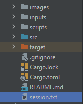
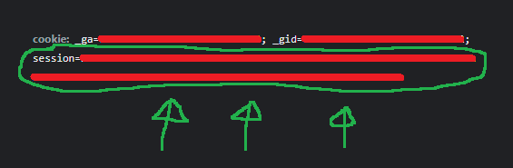
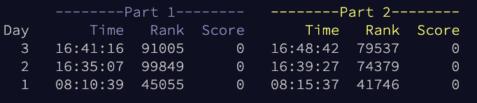

# Advent Of Code 2024
Solutions to AoC 2024 problems in Rust & Golang.

## Requirements
Create ``session.txt`` file in the project root (file ignored by git) with this line:

```sh
export AOC_SESSION={number} # cookie session value in your browser
```





## Get problem inputs
```sh
bash scripts/fetch-input.sh {day} # current day with 2 digits, e.g 01
```

## Run problems using bash scripts (Only Rust)
```sh
bash scripts/run-problem.sh {day}  # run a specific day, e.g 01
bash scripts/run-all.sh            # run all days
```

## Run problems using cargo commands (Only Rust)
```sh
cargo run --release --bin {day} # run a specific day, e.g 01
cargo run --release             # run all days
```

## Run problems using terminal (Only Golang)
```sh
cd golang/day{day}      # navigate to a specific day, e.g cd golang/day01
go run .                # run that specific day
```

## Leaderboard placings



## Benchmark
The following table contains wall-clock timings of all 25 solutions, as well as the produced answer to both parts. The time includes computing both parts of the problem, using the timing method in [lib.rs](src/lib.rs). It was done on an `Mac Mini M4 Pro 12 cores`.

| Day | Part 1 | Part 2 | Time Rust | Time Golang |
|:----|:------:|:------:|-----:|-----:|
| 01  |   2066446    |   24931009    |    117μs | 219.833µs |
| 02  |   224    |   293    |    257μs | 352.708µs |
| 03  |   178886550    |   87163705    |    856μs | 2.087833ms |
